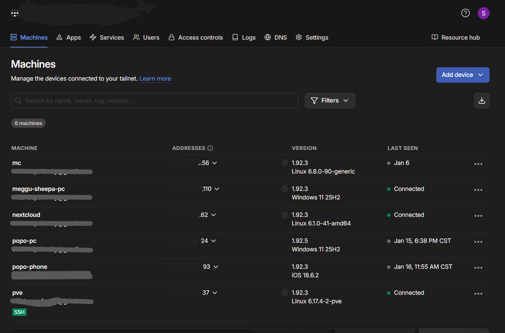

# Tailscale Integration — Proxmox VE Home Server

## Overview

This homelab uses Tailscale to provide secure remote access to internal services running on Proxmox VE, without exposing any ports to the public internet.

Tailscale creates a private, encrypted mesh VPN built on WireGuard, allowing devices and virtual machines to communicate as if they were on the same local network—regardless of physical location.

---

## Background & Motivation

### Initial Approach — Self-Hosted WireGuard

The original plan was to deploy a traditional WireGuard VPN server inside the Proxmox environment. This required:

- Router port forwarding  
- A public IP address or dynamic DNS  
- Manual firewall and NAT configuration  

Due to lack of reliable port-forwarding capabilities in my home network environment, this approach was not feasible.

---

### Solution — Tailscale

Tailscale eliminated these limitations entirely.

Instead of requiring inbound connections, Tailscale:
- Establishes outbound-only encrypted connections
- Automatically handles NAT traversal
- Uses relay nodes only when direct peer-to-peer connections are not possible
- Requires zero router configuration

---

## Why Tailscale Was a Game Changer

- End-to-end encrypted WireGuard tunnels  
- Secure remote access from anywhere  
- Each VM can independently join the VPN mesh  
- Identity-based authentication instead of exposed IPs  
- Minimal setup and maintenance  
- Low latency with direct peer-to-peer connections  

---

## How Tailscale Is Used

Tailscale is installed on:

- The Proxmox host  
- Selected Linux virtual machines  
- Personal client devices  

This enables:

- Secure SSH access to VMs  
- Private access to the Proxmox Web UI  
- VPN-only exposure of internal services  
- Safe remote administration from external networks  

No services are publicly exposed to the internet.

---

## Real-World Validation

- Successfully tested cross-continental file transfers using Nextcloud with a remote user in Nepal
- Confirms stable encrypted tunnels and reliable long-distance connectivity
- Other internal services are accessible remotely via Tailscale with consistent results

---

## Security Model

- No inbound firewall rules  
- No port forwarding  
- No public IP exposure  
- VPN-only service access  
- Explicit device-level authorization  

---

## Summary

Tailscale transformed remote access for my Proxmox home server from a complex networking challenge into a secure, scalable, and low-maintenance solution.

## Screenshots

